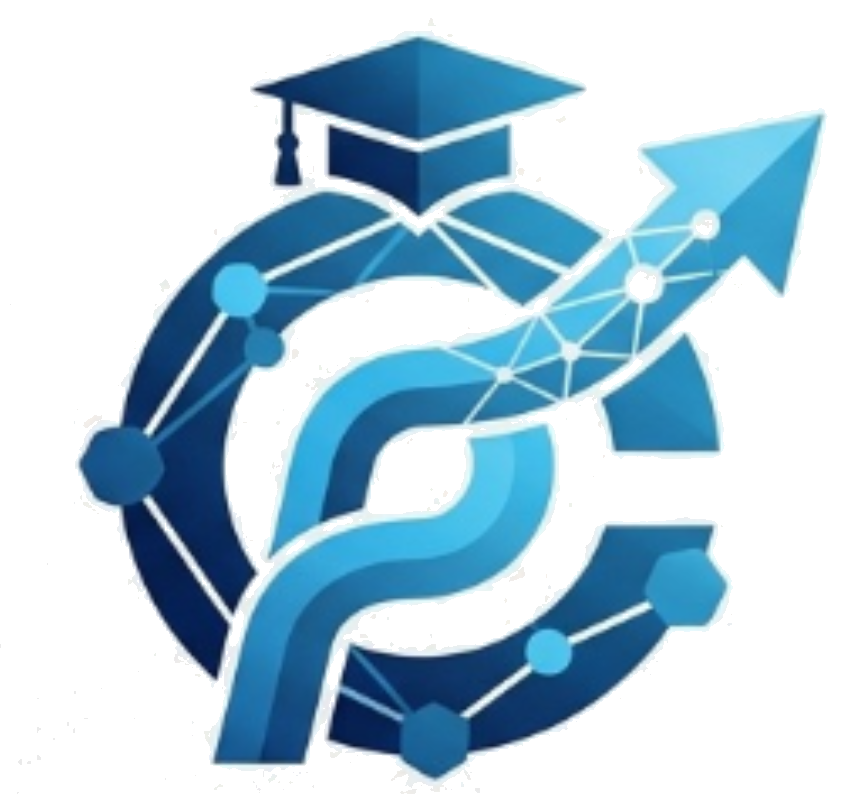

# 🎓 Campus Connect — Institutional Career & Placement Intelligence Platform

<div align="center">



**Empowering Campus Talent · Launching Career Trajectories**

[](https://www.python.org/)
[](https://flask.palletsprojects.com/)
[](https://ai.google.dev/)
[](https://vercel.com/)
[](LICENSE)

[Explore 520+ Opportunities](http://127.0.0.1:5000/jobs) · [AI Career Suite](http://127.0.0.1:5000/ai)

</div>

---

## 📖 Table of Contents
- [Executive Overview](#-executive-overview)
- [Core Production Pillars](#-core-production-pillars)
- [System Architecture](#-system-architecture)
- [Technology Stack](#-technology-stack)
- [Directory Structure](#-directory-structure)
- [Local Quickstart & Setup](#-local-quickstart--setup)
- [Deployment Guides (Vercel & Render)](#-deployment-guides)
- [Demo Credentials](#-demo-credentials)
- [Automated Testing & Link Health](#-automated-testing--link-health)
- [License & Acknowledgments](#-license--acknowledgments)

---

## 🌟 Executive Overview

**Campus Connect** is a production-grade, full-stack institutional placement and career intelligence portal built with **Python (Flask)**, **SQLite**, and **Google Gemini AI**. Designed specifically for collegiate ecosystems, it unifies over **520+ live, verified opportunities** across full-time graduate recruitment and national internship schemes, with 100% direct-to-application deep links.

---

## 🚀 Core Production Pillars

### 1. 📈 520+ Production Opportunity Catalog
- **🎓 Placements & Jobs (260+ Listings)**: Sourced from premier tech giants and recruitment networks including *Infosys, TCS Digital, Wipro, Google, Microsoft, Amazon, Deloitte, Tech Mahindra, Razorpay, PhonePe, Swiggy, Zomato, Cred, Paytm, Meesho, Groww, Zerodha, Postman, Cisco, Oracle, SAP Labs, Adobe, Intel, AMD, Qualcomm, AccioJob, AICTE, SJCE, NMAMIT, and Naukri.com*.
- **💼 Internships & PM Scheme (260+ Listings)**: Curated tracks from the *Prime Minister's Internship Scheme* (top 500 corporates including *TCS, L&T, Reliance, Tata Motors, HDFC Bank, Mahindra, Adani, Maruti Suzuki, NTPC, ONGC, SBI, HUL, Coal India, BHEL, GAIL*) alongside *AICTE Regional Hub (Hyderabad), Internshala, LinkedIn, and Indeed*.

### 2. 🔗 100% Direct Pre-Filtered Application Deep Links
- **Zero Homepage Roots**: Every listing links directly to the specific job permalink or pre-filtered student/India career board (e.g. `career.infosys.com/joblist?countrycode=IN&companyhiringtype=IL`, `careers.techmahindra.com/JobSearch.aspx?exp=0-1`).
- **Ingestion-Time URL Validation**: Automatic rejection of bare homepage domains.
- **Safe Session Preserving**: All application triggers open in a new tab (`target="_blank" rel="noopener noreferrer"`), ensuring candidates never lose their place in the portal.

### 3. ⭐ Featured Top Employers & MNCs Showcase
- Prominently showcases high-tier corporate partners (*Google, Microsoft, Deloitte, Tech Mahindra, Infosys, Amazon, TCS, Wipro, Accenture, Capgemini, IBM, PM Scheme*) with custom vector SVG branding, hiring tracks, and instant 1-click application access.

### 4. 🤖 Google Gemini AI Career Suite (`/ai`)
- **AI Career Advisor**: Placement strategist analyzing CGPA eligibility, interview rounds, and personalized placement roadmaps.
- **AI Technical Tutor & Mock Interviewer**: Interactive DSA coach providing clean code walkthroughs and real-time placement coding challenges.
- **Multi-Turn Chat Assistant**: Intelligent conversational engine with streaming UI, starter chips, and Markdown syntax highlighting.

### 5. 👨‍🎓 Comprehensive Student & Admin Portals
- **Student Dashboard**: Live KPI metrics (Profile Strength, Match Score, Active Applications), academic snapshots, and scheduled announcements.
- **Placement Office Admin**: Manage recruitment drives, audit student cohort eligibility, monitor company engagements, and broadcast alerts.

---

## 🏗️ System Architecture

```
                                +---------------------------+
                                |    Client Web Browser     |
                                |  (Desktop, Tablet, Mobile)|
                                +-------------+-------------+
                                              |
                                              | HTTPS (Jinja2 / REST API)
                                              v
+------------------------------------------------------------------------------------------+
|                              Campus Connect Application Server                           |
|                                (Vercel Serverless / Gunicorn)                            |
|                                                                                          |
|   +-----------------------+   +------------------------+   +-------------------------+   |
|   | Public / Jobs Hub     |   | Auth & Session Guard   |   | Student & Admin Portals |   |
|   |  - 520+ Aggregated    |   |  - Werkzeug Security   |   |  - Dynamic Dashboards   |   |
|   |  - Category Tabs      |   |  - Role Access Control |   |  - Resume & Match Score |   |
|   |  - Segmented Filter   |   |  - Notifications       |   |  - Announcements        |   |
|   +-----------+-----------+   +-----------+------------+   +------------+------------+   |
|               |                           |                             |                |
|               v                           v                             v                |
|   +----------------------------------------------------------------------------------+   |
|   |                         Job Service & Ingestion Engine                           |   |
|   |  - Direct Apply URL Validation  |  - In-Memory Cache (TTL)  |  - Deduplication   |   |
|   +---------------------------------------+------------------------------------------+   |
|                                           |                                              |
|                                           v                                              |
|   +-----------------------+   +------------------------+   +-------------------------+   |
|   | Local SQLite Database |   | Google Gemini AI Suite |   | Verified External Portals|  |
|   | (placement.db)        |   | (REST Model Proxy)     |   | (Direct Apply Deep Links)|  |
|   +-----------------------+   +------------------------+   +-------------------------+   |
+------------------------------------------------------------------------------------------+
```

---

## 🛠️ Technology Stack

| Layer | Technologies | Description |
|---|---|---|
| **Backend** | Python 3.11+, Flask 3.0+ | Modular application architecture using Flask Blueprints |
| **WSGI Server** | Gunicorn (Multi-threaded) | Production WSGI server with multi-worker support |
| **AI Engine** | Google Gemini 3.5 Flash | Multi-turn reasoning, coding coaching, and career guidance |
| **Database** | SQLite 3 | Relational database with parameterized queries and foreign keys |
| **Security** | Werkzeug Security, CSRF | Password hashing, session cookies, and role guards |
| **Frontend** | HTML5, Modern CSS3, Vanilla JS | High-contrast Light/Dark mode, zero runtime JS framework overhead |
| **Vector Graphics** | Custom Vector SVGs | 40+ local brand emblems and portal badges |
| **Deployment** | Vercel Serverless / Docker on Render | Multi-platform production deployment readiness |

---

## 📂 Directory Structure

```
Campus Connect/
├── app.py                     # Main Flask Application Factory
├── config.py                  # Production Configuration
├── db.py                      # Database Connector & Helpers
├── auth.py                    # Role Guards & User Loader
├── schema.sql                 # Complete Relational Database Schema
├── seed_data.py               # Database Seeder (Demo Users & Companies)
├── requirements.txt           # Production Dependencies
├── Dockerfile                 # Multi-Stage Production Container
├── render.yaml                # 1-Click Render Deployment Blueprint
├── vercel.json                # Vercel Serverless Routing Config
├── wsgi.py                    # WSGI Production Entry Point
├── api/
│   └── index.py               # Vercel Serverless WSGI Handler & Middleware
├── routes/
│   ├── public_routes.py       # Landing, Jobs Hub (520+ Items), AI Suite, About
│   ├── auth_routes.py         # Login, Registration, Logout
│   ├── student_routes.py      # Student Dashboard, Profile, Applications
│   ├── admin_routes.py        # Placement Admin Dashboard & Drive Management
│   └── api_routes.py          # AI Gemini Proxy & Job Search APIs
├── services/
│   ├── job_service.py         # 520+ Opportunity Aggregator & URL Validator
│   └── gemini_service.py      # Google Gemini AI Multi-Turn Integration
├── static/
│   ├── css/style.css          # Design System, Themes, Components, Grid
│   └── images/
│       ├── logo.png           # Brand Logo & Multi-size Favicons
│       └── companies/         # 40+ Local Vector SVG Brand Emblems
└── templates/
    ├── base.html              # Core Layout & Global Header/Footer
    ├── base_dashboard.html    # Role-Based App Shell & Collapsible Sidebar
    ├── landing.html           # 10-Section Marketing & Showcase Landing Page
    ├── jobs.html              # Jobs & Internships Hub with Pagination
    ├── _jobs_body.html        # Reusable Opportunity Grid & MNC Showcase
    ├── ai_suite.html          # AI Career Suite Interface
    ├── student/               # Student Dashboard & Profile Views
    └── admin/                 # Placement Admin Analytics & Controls
```

---

## 💻 Local Quickstart & Setup

### Prerequisites
- Python 3.11 or higher installed on your system.
- Git installed.

### 1. Clone the Repository & Navigate
```bash
git clone https://github.com/balrajpranay/Campus-Connect.git
cd Campus-Connect
```

### 2. Set Up a Virtual Environment
```bash
# Windows
python -m venv venv
venv\Scripts\activate

# macOS / Linux
python3 -m venv venv
source venv/bin/activate
```

### 3. Install Dependencies
```bash
pip install -r requirements.txt
```

### 4. Configure Environment Variables
Create a `.env` file in the project root:
```env
SECRET_KEY=campus-connect-production-secret-key-2026
GEMINI_API_KEY=your-gemini-api-key-here
GEMINI_MODEL=gemini-3.5-flash
FLASK_ENV=production
```

### 5. Seed the Database
```bash
python seed_data.py
```

### 6. Run the Application
```bash
python app.py
```
Open your browser at **`http://127.0.0.1:5000`**.

---

## ☁️ Deployment Guides

### Option 1: Deploy on Vercel
1. Import repository at **[vercel.com/new](https://vercel.com/new)**.
2. Under **Environment Variables**, add:
   - `GEMINI_API_KEY`: *(Your Google Gemini API Key)*
   - `SECRET_KEY`: `campus-connect-production-secret-key-2026`
3. Click **Deploy**.

### Option 2: Deploy on Render
1. Go to **[dashboard.render.com](https://dashboard.render.com/)**.
2. Click **New +** &rarr; **Web Service** &rarr; select **`balrajpranay/Campus-Connect`**.
3. Choose **Docker** environment and add your Environment Variables.
4. Click **Deploy Web Service**.

---

## 👥 Demo Credentials

| Role | Email | Password | Access Capabilities |
|---|---|---|---|
| 👨‍🎓 **Student** | `priya.sharma@student.edu` | `student123` | Student Dashboard, Applications, Profile, AI Suite |
| 👨‍🎓 **Student (Alternative)** | `rahul.verma@student.edu` | `student123` | Student Profile & Application Tracking |
| 🏛️ **Placement Admin** | `admin@college.edu` | `admin123` | Institutional Analytics, Cohort Auditing, Drives |

---

## 🧪 Automated Testing & Link Health

Run the built-in diagnostic test suites:

```bash
# Verify 520+ Opportunity Catalog & Pagination
python scratch/verify_production_scale_500.py

# Verify Direct Apply Deep Links & URL Health
python scratch/verify_direct_apply_links.py

# Verify Featured Top MNCs Showcase
python scratch/verify_featured_companies.py
```

---

## 📄 License & Acknowledgments

Distributed under the **MIT License**. See `LICENSE` for more information.

Special thanks to:
- **Google DeepMind** for the Gemini AI Model API.
- **AICTE & Ministry of Corporate Affairs** for the Prime Minister's Internship Scheme initiative.
- All contributing academic institutions and recruitment partners.

---

<div align="center">
  <sub>Built with ❤️ for student career acceleration.</sub>
</div>
